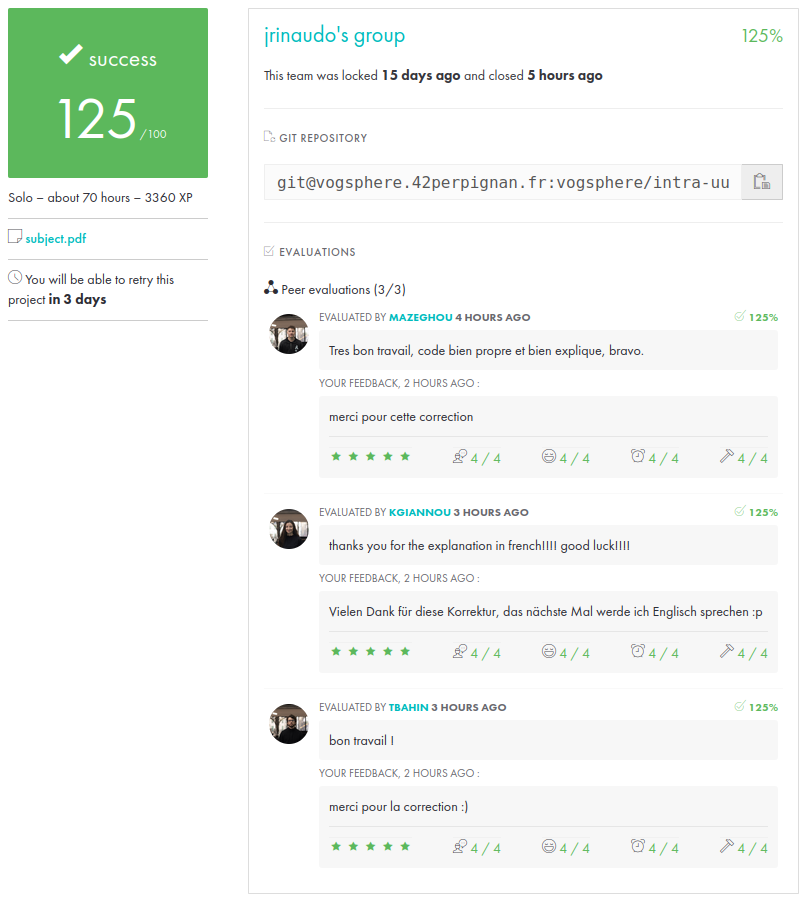
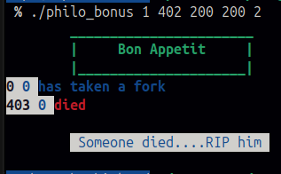
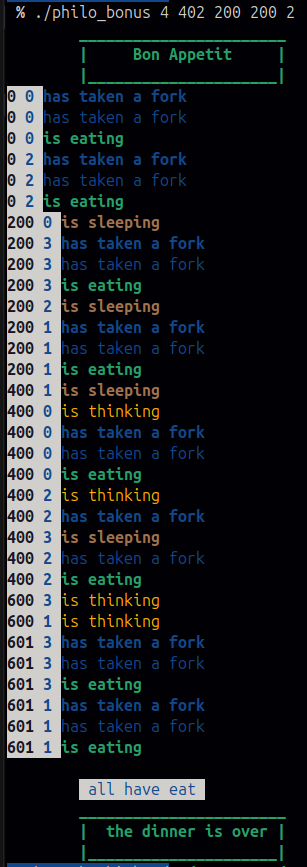

# Philosophers
a big plate full of spaghettis, some philosophers, some forks and you have a new problem to solve

Cojori
## ->tout d'abord, une petite explication s'impose ^^

🧵 Threads et Processus : Explication et Comparaison
🇫🇷 
🔹 Qu'est-ce qu'un processus ?

Un processus est une instance d'un programme en cours d'exécution.
Il possède :

    Son propre espace mémoire (mémoire allouée indépendamment des autres processus).
    Ses propres ressources (descripteurs de fichiers, signaux, etc.).
    Son propre PID (Process Identifier).

Chaque programme lancé sur un système (par exemple ./philo_bonus) crée un processus principal qui peut exécuter des sous-processus grâce à la fonction fork().
📌 Caractéristiques des processus :

✅ Isolation : Un processus ne peut pas directement accéder à la mémoire d’un autre processus.
✅ Stabilité : Si un processus plante, cela n'affecte pas les autres.
❌ Coût élevé : La création d'un processus est plus lente qu’un thread car elle implique une copie de l'espace mémoire.
📌 Quand utiliser des processus ?

    Lorsque l'on souhaite isoler différentes tâches pour éviter qu’un crash ne perturbe l’ensemble du programme.
    Lorsqu’on doit utiliser plusieurs CPU indépendamment (exécution parallèle).
    Lorsque la synchronisation entre les tâches est moins fréquente.

🔹 Qu'est-ce qu'un thread ?

Un thread est une unité d'exécution légère qui partage l’espace mémoire avec son processus parent. Un processus peut contenir plusieurs threads.
📌 Caractéristiques des threads :

✅ Rapides : Création et commutation plus rapides que les processus.
✅ Partage de mémoire : Tous les threads d'un même processus accèdent aux mêmes variables globales.
❌ Moins isolés : Si un thread rencontre une erreur grave (ex. segfault), tout le processus peut être affecté.
📌 Quand utiliser des threads ?

    Lorsque plusieurs tâches doivent partager des ressources rapidement.
    Lorsqu’on veut éviter la surcharge de création de nouveaux processus.
    Pour optimiser les performances en exécutant plusieurs tâches en parallèle tout en partageant la mémoire.

🔥 Comparaison Threads vs Processus
Critère	Processus	Threads
Mémoire	Indépendante	Partagée avec le processus parent
Communication	Plus lente (IPC requis)	Rapide (accès mémoire direct)
Création	Lourde (fork, duplication mémoire)	Légère (pthread_create)
Isolation	Oui (erreur locale)	Non (affecte tout le processus)
Utilisation	Programmes isolés, multi-programmation	Exécution parallèle, multitâche léger
🏆 Quel choix pour le projet "Philosophers" ?

    Mandatory : Utilisation des threads car les philosophes doivent partager des ressources (les fourchettes) et la communication est fréquente.
    Bonus : Utilisation des processus car chaque philosophe est totalement indépendant, ce qui évite que l’erreur d’un philosophe ne perturbe les autres.

🇬🇧 Threads vs Processes: Understanding the Differences
🔹 What is a process?

A process is an instance of a running program. It has:

    Its own memory space (allocated independently from other processes).
    Its own resources (file descriptors, signals, etc.).
    Its own PID (Process Identifier).

Each launched program (e.g., ./philo_bonus) creates a main process that can execute sub-processes using the fork() function.
📌 Process Characteristics:

✅ Isolation: A process cannot directly access another process’s memory.
✅ Stability: If a process crashes, others remain unaffected.
❌ High overhead: Creating a process is slower than a thread since it involves duplicating memory space.
📌 When to use processes?

    When we need isolation to prevent crashes from affecting the entire program.
    When multiple CPUs need to be utilized independently (parallel execution).
    When synchronization is less frequent between tasks.

🔹 What is a thread?

A thread is a lightweight execution unit within a process. Multiple threads can exist in the same process, sharing the same memory space.
📌 Thread Characteristics:

✅ Fast: Creating and switching threads is faster than processes.
✅ Memory sharing: All threads in a process can access the same global variables.
❌ Less isolation: A severe thread error (e.g., segmentation fault) can crash the entire process.
📌 When to use threads?

    When multiple tasks need to share resources quickly.
    When we want to avoid the overhead of creating new processes.
    To optimize performance by executing multiple tasks in parallel while sharing memory.

🔥 Comparison: Threads vs Processes
Criterion	Processes	Threads
Memory	Independent	Shared with the parent process
Communication	Slower (needs IPC)	Faster (direct memory access)
Creation	Heavy (fork, memory duplication)	Lightweight (pthread_create)
Isolation	Yes (local error)	No (affects entire process)
Use case	Isolated programs, multi-programming	Parallel execution, lightweight multitasking
🏆 Which Choice for the "Philosophers" Project?

    Mandatory: Uses threads since philosophers must share resources (forks) and communicate frequently.
    Bonus: Uses processes since each philosopher is completely independent, preventing one philosopher’s failure from affecting the others.

This explanation provides a clear distinction between threads and processes and when to use them. 🚀 Let me know if you need more details!

## 🔒 Mutex vs Sémaphores : Explication et Comparaison
🇫🇷
🔹 Qu'est-ce qu'un Mutex ?

Un mutex (Mutual Exclusion) est un mécanisme permettant de garantir qu’une ressource partagée (par exemple, une variable ou une fourchette dans le projet Philosophers) ne soit utilisée que par un seul thread à la fois.

Lorsqu’un thread verrouille un mutex (pthread_mutex_lock()), les autres doivent attendre que le mutex soit libéré (pthread_mutex_unlock()) avant d’y accéder.
📌 Caractéristiques des Mutex :

✅ Rapide et efficace : Idéal pour protéger une unique ressource partagée.
✅ Simple d'utilisation : Un thread verrouille, un autre attend, puis déverrouille.
❌ Blocage possible : Un thread bloqué sur un mutex reste en attente.
❌ Risque de deadlock : Si deux threads verrouillent mutuellement des mutex différents et attendent indéfiniment.
📌 Quand utiliser un Mutex ?

    Lorsqu’on doit protéger une variable partagée.
    Lorsque l’accès doit être strictement exclusif (un seul thread/processus à la fois).
    Lorsque l’on travaille avec les threads (comme dans la partie mandatory du projet Philosophers).

🔹 Qu'est-ce qu'un Sémaphore ?

Un sémaphore est un compteur qui contrôle l’accès concurrentiel à une ressource partagée. Contrairement aux mutex, un sémaphore peut autoriser plusieurs threads ou processus à accéder simultanément à une ressource.

Les sémaphores sont initialisés avec une valeur représentant le nombre maximal de threads/processus qui peuvent accéder à la ressource en même temps.
📌 Caractéristiques des Sémaphores :

✅ Peut gérer plusieurs accès simultanés : Permet de limiter N threads/processus en parallèle.
✅ Utilisable entre plusieurs processus : Contrairement aux mutex qui sont liés à un seul processus.
❌ Plus complexe : Doit être bien conçu pour éviter les incohérences.
❌ Risque d’inversion de priorité : Un thread en attente peut ne jamais être servi s’il y a une file d’attente.
📌 Quand utiliser un Sémaphore ?

    Lorsqu’on veut contrôler plusieurs accès simultanés.
    Lorsque plusieurs processus distincts doivent synchroniser leur exécution.
    Lorsqu’on travaille avec des processus (fork), comme dans la partie bonus du projet Philosophers.

🔥 Comparaison Mutex vs Sémaphore
Critère	Mutex	Sémaphore
Exclusion mutuelle	Oui (1 seul accès)	Peut autoriser plusieurs accès
Utilisation	Protège une ressource unique	Contrôle un nombre d'accès simultanés
Bloquant	Oui (attente si verrouillé)	Non (utilisation de sem_trywait() possible)
Complexité	Simple	Plus complexe (gestion du comptage)
Entre processus	Non	Oui
Utilisation dans Philosophers	Mandatory (Threads)	Bonus (Processus)
🏆 Quel choix pour le projet "Philosophers" ?

    Mandatory : Utilisation des mutex car chaque philosophe doit verrouiller une fourchette individuellement et seul un thread peut y accéder à la fois.
    Bonus : Utilisation des sémaphores car les philosophes sont des processus distincts et les fourchettes doivent être gérées globalement (non limitées à un seul processus).

🇬🇧 Mutex vs Semaphores: Understanding the Differences
🔹 What is a Mutex?

A mutex (Mutual Exclusion) is a mechanism that ensures a shared resource (e.g., a fork in the Philosophers project) is used by only one thread at a time.

When a thread locks a mutex (pthread_mutex_lock()), others must wait until it is unlocked (pthread_mutex_unlock()) before they can access it.
📌 Mutex Characteristics:

✅ Fast and efficient: Ideal for protecting a single shared resource.
✅ Simple usage: One thread locks, others wait, then unlock.
❌ Can cause blocking: A thread waiting on a locked mutex remains stuck.
❌ Risk of deadlock: If two threads lock different mutexes and wait for each other indefinitely.
📌 When to use a Mutex?

    When you need to protect a shared variable.
    When strict exclusive access is required (only one thread at a time).
    When working with threads (as in the mandatory part of the Philosophers project).

🔹 What is a Semaphore?

A semaphore is a counter that controls concurrent access to a shared resource. Unlike mutexes, a semaphore can allow multiple threads/processes to access a resource simultaneously.

Semaphores are initialized with a value that represents the maximum number of threads/processes that can access the resource at the same time.
📌 Semaphore Characteristics:

✅ Can handle multiple simultaneous accesses: Limits N threads/processes in parallel.
✅ Works across multiple processes: Unlike mutexes, which are bound to a single process.
❌ More complex: Needs proper design to prevent inconsistencies.
❌ Priority inversion risk: A waiting thread might never be served if there is a long queue.
📌 When to use a Semaphore?

    When you need to control multiple simultaneous accesses.
    When multiple separate processes need to synchronize execution.
    When working with processes (fork), as in the bonus part of the Philosophers project.

🔥 Comparison: Mutex vs Semaphore
Criterion	Mutex	Semaphore
Mutual exclusion	Yes (only 1 access)	Can allow multiple accesses
Usage	Protects a single resource	Controls multiple simultaneous accesses
Blocking	Yes (waits if locked)	No (sem_trywait() can be used)
Complexity	Simple	More complex (counter management)
Cross-process	No	Yes
Use in Philosophers	Mandatory (Threads)	Bonus (Processes)
🏆 Which Choice for the "Philosophers" Project?

    Mandatory: Uses mutexes because each philosopher must lock a fork individually, and only one thread can access it at a time.
    Bonus: Uses semaphores because philosophers are separate processes, and forks need to be managed globally (not tied to a single process).

### -> Maintenant, on peut rentrer dans le vif du sujet

⚙️ Partie Obligatoire
📝 Fonctionnalités principales

    Chaque philosophe est un thread.
    Il y a un mutex pour chaque fourchette afin d'empêcher plusieurs philosophes de l'utiliser en même temps.
    Un philosophe doit prendre deux fourchettes pour manger.
    Après avoir mangé, un philosophe repose ses fourchettes et dort.
    La simulation s'arrête lorsqu'un philosophe meurt de faim ou si tous ont mangé un nombre prédéfini de fois.

📌 Fonctions utilisées et leur rôle :

    pthread_create : crée un thread pour chaque philosophe.
    pthread_detach : détache un thread pour qu’il se termine automatiquement.
    pthread_join : attend la fin d'un thread.
    pthread_mutex_init : initialise un mutex.
    pthread_mutex_lock : verrouille un mutex (empêche d'autres threads d'accéder à la ressource protégée).
    pthread_mutex_unlock : déverrouille un mutex.
    pthread_mutex_destroy : détruit un mutex.
    usleep : permet aux philosophes de "dormir" en suspendant l'exécution du thread pendant un certain temps.
    gettimeofday : mesure le temps pour la gestion de la simulation.
    write : affiche les messages des philosophes.

🚀 Partie Bonus
📝 Améliorations par rapport à la partie obligatoire :

    Les philosophes sont désormais des processus au lieu de threads.
    Les fourchettes sont représentées par un sémaphore unique.
    Un processus principal gère tous les philosophes et détecte leur mort.
    Un philosophe qui meurt met fin à tous les autres processus.

📌 Fonctions supplémentaires utilisées :

    fork : crée un processus enfant pour chaque philosophe.
    kill : termine un processus donné.
    waitpid : attend la fin d’un processus.
    exit : termine un processus.
    sem_open : initialise un sémaphore.
    sem_close : ferme un sémaphore.
    sem_post : incrémente (libère) un sémaphore.
    sem_wait : décrémente (verrouille) un sémaphore.
    sem_unlink : supprime un sémaphore du système.

🔥 Comment exécuter le programme ?
Partie obligatoire :

make && ./philo <nb_philosophes> <time_to_die> <time_to_eat> <time_to_sleep> [nb_meals]

Exemple :

./philo 5 800 200 200 5

Partie bonus :

make bonus && ./philo_bonus <nb_philosophes> <time_to_die> <time_to_eat> <time_to_sleep> [nb_meals]

Exemple :

./philo_bonus 5 800 200 200 5

🎯 Cas de test utiles

    Un philosophe seul : ./philo 1 400 100 100
    Un temps de vie plus court que le temps de repas : ./philo 5 200 300 100
    Un nombre élevé de philosophes : ./philo 200 800 200 200
    Un temps de sommeil plus long que le temps de vie : ./philo 5 500 200 600
    Simulation complète avec fin normale : ./philo 5 800 200 200 10

🧠 Philosophers - 42 Project
📌 Introduction

This project simulates the famous dining philosophers problem using threads and mutexes for the mandatory part, and processes and semaphores for the bonus. The goal is to learn concurrency management, synchronization, and shared resource handling in a multi-threaded or multi-process environment.
⚙️ Mandatory Part
📝 Main Features

    Each philosopher is a thread.
    A mutex protects each fork to prevent multiple philosophers from using it simultaneously.
    A philosopher must take two forks to eat.
    After eating, a philosopher releases the forks and sleeps.
    The simulation stops when a philosopher dies from starvation or when all philosophers have eaten a predefined number of times.

📌 Functions Used and Their Roles:

    pthread_create : creates a thread for each philosopher.
    pthread_detach : detaches a thread so it terminates automatically.
    pthread_join : waits for a thread to finish.
    pthread_mutex_init : initializes a mutex.
    pthread_mutex_lock : locks a mutex (prevents other threads from accessing the protected resource).
    pthread_mutex_unlock : unlocks a mutex.
    pthread_mutex_destroy : destroys a mutex.
    usleep : makes philosophers "sleep" by suspending execution for a specific time.
    gettimeofday : measures time to manage the simulation.
    write : prints philosopher messages.

🚀 Bonus Part
📝 Improvements over the Mandatory Part:

    Philosophers are now processes instead of threads.
    Forks are represented by a single semaphore.
    A main process manages all philosophers and detects deaths.
    If a philosopher dies, all processes are terminated.

📌 Additional Functions Used:

    fork : creates a child process for each philosopher.
    kill : terminates a process.
    waitpid : waits for a process to end.
    exit : terminates a process.
    sem_open : initializes a semaphore.
    sem_close : closes a semaphore.
    sem_post : increments (releases) a semaphore.
    sem_wait : decrements (locks) a semaphore.
    sem_unlink : removes a semaphore from the system.

🔥 How to Run the Program?
Mandatory Part:

make && ./philo <nb_philosophers> <time_to_die> <time_to_eat> <time_to_sleep> [nb_meals]

Example:

./philo 5 800 200 200 5

Bonus Part:

make bonus && ./philo_bonus <nb_philosophers> <time_to_die> <time_to_eat> <time_to_sleep> [nb_meals]

Example:

./philo_bonus 5 800 200 200 5

🎯 Useful Test Cases

    A single philosopher: ./philo 1 400 100 100
    A short life span compared to the eating time: ./philo 5 200 300 100
    A high number of philosophers: ./philo 200 800 200 200
    A longer sleeping time than the life span: ./philo 5 500 200 600
    Complete simulation with normal ending: ./philo 5 800 200 200 10

📌 Notes

    The mandatory part uses threads and mutexes.
    The bonus part uses processes and semaphores.
    The simulation must avoid race conditions and ensure fair resource allocation.

## come sources i used

https://medium.com/@ruinadd/philosophers-42-guide-the-dining-philosophers-problem-893a24bc0fe2

https://medium.com/@denaelgammal/dining-philosophers-problem-42-project-guide-mandatory-part-a20fb8dc530e

https://www.youtube.com/watch?v=LOfGJcVnvAk

https://fr.wikipedia.org/wiki/D%C3%AEner_des_philosophes

https://www.youtube.com/watch?v=ldJ8WGZVXZk

https://franckh.developpez.com/tutoriels/posix/pthreads/

BONUS PART:
https://www.backblaze.com/blog/whats-the-diff-programs-processes-and-threads/#:~:text=Computer%20processes%20are%20independent%20program,easier%20but%20requiring%20careful%20synchronization.

some exemples :

